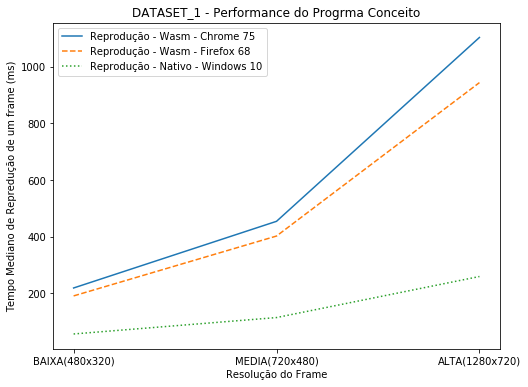
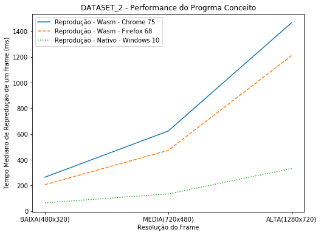
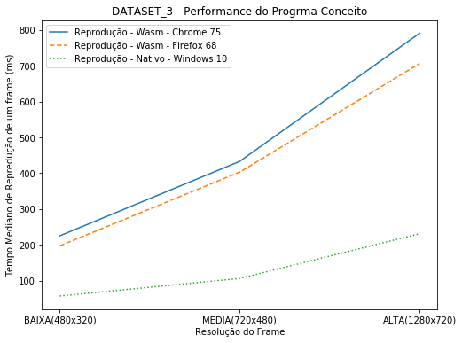
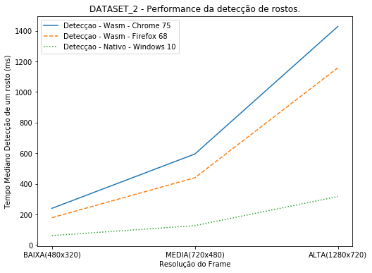
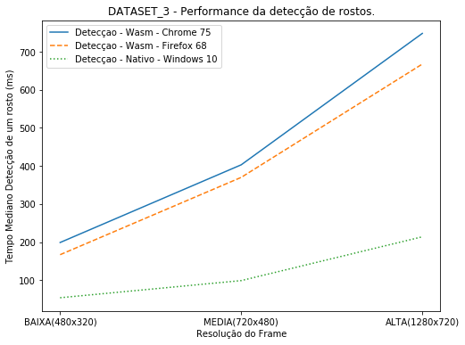
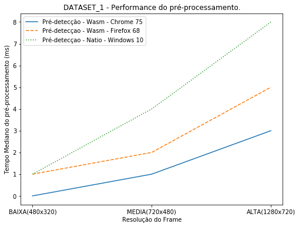
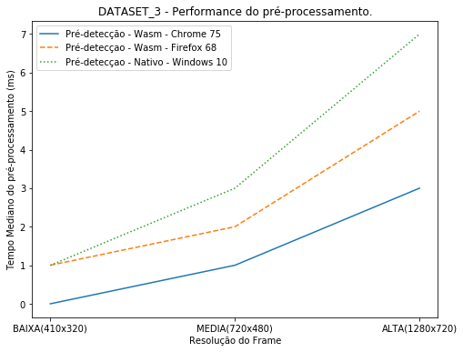
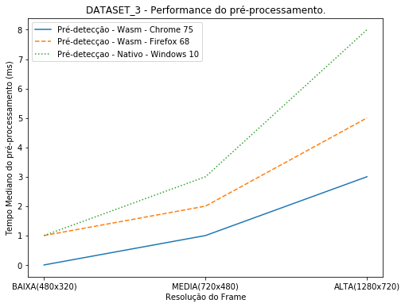
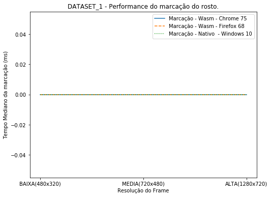
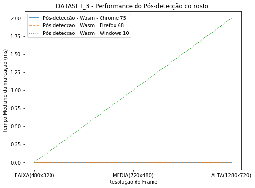

# TCC WASM -  Análise Estatiscas

Análise dos dados de execução do processamento de detecção de faces compilados com WebAssembly versus compilação nativa com visual C++. O objetivo desta pesqusias em constatar a diferença de performance entre um código compilado p/ WebAssembly e outro com compilaçção nativa.

## Ferramentas para analise


```python
import numpy as np
import pandas as pd
import os
import matplotlib
import matplotlib.pyplot as plt
import matplotlib.gridspec as gridspec
```

## Dados de testes

O conjunto de dados de teste é formado por três vídeos selecionados a partir do *site* YouTube.
Os critérios de seleção foram: ser um video de acesso publico, ou seja, sem restrições para reprodução e estar 
disponível em formato MPEG-4 com resolução padrão de 1920px por 1080px.


```python
df_dataset = pd.read_csv('./data/dataset.csv')
df_dataset
```


<div>
<style scoped>
    .dataframe tbody tr th:only-of-type {
        vertical-align: middle;
    }

    .dataframe tbody tr th {
        vertical-align: top;
    }

    .dataframe thead th {
        text-align: right;
    }
</style>
<table border="1" class="dataframe">
  <thead>
    <tr style="text-align: right;">
      <th></th>
      <th>id</th>
      <th>extension</th>
      <th>resolution</th>
      <th>frames</th>
      <th>fps</th>
      <th>youtube_link</th>
    </tr>
  </thead>
  <tbody>
    <tr>
      <th>0</th>
      <td>DATASET_1</td>
      <td>mp4</td>
      <td>1920x1080</td>
      <td>3915</td>
      <td>24</td>
      <td>https://www.youtube.com/watch?v=EWUdGRAwUpY</td>
    </tr>
    <tr>
      <th>1</th>
      <td>DATASET_2</td>
      <td>mp4</td>
      <td>1920x1080</td>
      <td>3020</td>
      <td>30</td>
      <td>https://www.youtube.com/watch?v=vQtLX6pW5eA</td>
    </tr>
    <tr>
      <th>2</th>
      <td>DATASET_3</td>
      <td>mp4</td>
      <td>1920x1080</td>
      <td>12296</td>
      <td>50</td>
      <td>https://www.youtube.com/watch?v=RuL5jVqc4Tg</td>
    </tr>
  </tbody>
</table>
</div>


## Resultados

Foram feitos testes com uma aplicação nativa usado o Windows10 e com WebAssembly usando Chrome 75 e Firefox 67 executando no mesmo sistema operacional e maquina fisica com as configuraçãoes padrão de instalação. 


```python
df_meta_fd = pd.read_csv('./data/META_LOG_FACE_DETECT.csv')
df_meta_fd
```


<div>
<style scoped>
    .dataframe tbody tr th:only-of-type {
        vertical-align: middle;
    }

    .dataframe tbody tr th {
        vertical-align: top;
    }

    .dataframe thead th {
        text-align: right;
    }
</style>
<table border="1" class="dataframe">
  <thead>
    <tr style="text-align: right;">
      <th></th>
      <th>workload</th>
      <th>dataset</th>
      <th>resolution</th>
      <th>system</th>
      <th>total_frames</th>
      <th>total_frames_processeds</th>
      <th>test_total_time_ms</th>
      <th>log_file</th>
    </tr>
  </thead>
  <tbody>
  </tbody>
</table>
</div>


## Carregar dados de teste


```python
#dataset_1
df_d1sc = pd.read_csv('./data/LOG_FACE_DETECT_DATASET_1_SMALL_Chrome_75_Windows.csv')
df_d1mc = pd.read_csv('./data/LOG_FACE_DETECT_DATASET_1_MEDIUM_Chrome_75_Windows.csv')
df_d1lc = pd.read_csv('./data/LOG_FACE_DETECT_DATASET_1_LARGE_Chrome_75_Windows.csv')
df_d1sf = pd.read_csv('./data/LOG_FACE_DETECT_DATASET_1_SMALL_Firefox_68_Windows.csv')
df_d1mf = pd.read_csv('./data/LOG_FACE_DETECT_DATASET_1_MEDIUM_Firefox_68_Windows.csv')
df_d1lf = pd.read_csv('./data/LOG_FACE_DETECT_DATASET_1_LARGE_Firefox_68_Windows.csv')
df_d1swin = pd.read_csv('./data/LOG_FACE_DETECT_DATASET_1_SMALL_WINDOWS_10_WIN32.csv')
df_d1mwin = pd.read_csv('./data/LOG_FACE_DETECT_DATASET_1_MEDIUM_WINDOWS_10_WIN32.csv')
df_d1lwin = pd.read_csv('./data/LOG_FACE_DETECT_DATASET_1_LARGE_WINDOWS_10_WIN32.csv')

#dataset_2
df_d2sc = pd.read_csv('./data/LOG_FACE_DETECT_DATASET_2_SMALL_Chrome_75_Windows.csv')
df_d2mc = pd.read_csv('./data/LOG_FACE_DETECT_DATASET_2_MEDIUM_Chrome_75_Windows.csv')
df_d2lc = pd.read_csv('./data/LOG_FACE_DETECT_DATASET_2_LARGE_Chrome_75_Windows.csv')
df_d2sf = pd.read_csv('./data/LOG_FACE_DETECT_DATASET_2_SMALL_Firefox_68_Windows.csv')
df_d2mf = pd.read_csv('./data/LOG_FACE_DETECT_DATASET_2_MEDIUM_Firefox_68_Windows.csv')
df_d2lf = pd.read_csv('./data/LOG_FACE_DETECT_DATASET_2_LARGE_Firefox_68_Windows.csv')
df_d2swin = pd.read_csv('./data/LOG_FACE_DETECT_DATASET_2_SMALL_WINDOWS_10_WIN32.csv')
df_d2mwin = pd.read_csv('./data/LOG_FACE_DETECT_DATASET_2_MEDIUM_WINDOWS_10_WIN32.csv')
df_d2lwin = pd.read_csv('./data/LOG_FACE_DETECT_DATASET_2_LARGE_WINDOWS_10_WIN32.csv')

#dataset_3
df_d3sc = pd.read_csv('./data/LOG_FACE_DETECT_DATASET_3_SMALL_Chrome_75_Windows.csv')
df_d3mc = pd.read_csv('./data/LOG_FACE_DETECT_DATASET_3_MEDIUM_Chrome_75_Windows.csv')
df_d3lc = pd.read_csv('./data/LOG_FACE_DETECT_DATASET_3_LARGE_Chrome_75_Windows.csv')
df_d3sf = pd.read_csv('./data/LOG_FACE_DETECT_DATASET_3_SMALL_Firefox_68_Windows.csv')
df_d3mf = pd.read_csv('./data/LOG_FACE_DETECT_DATASET_3_MEDIUM_Firefox_68_Windows.csv')
df_d3lf = pd.read_csv('./data/LOG_FACE_DETECT_DATASET_3_LARGE_Firefox_68_Windows.csv')
df_d3swin = pd.read_csv('./data/LOG_FACE_DETECT_DATASET_3_SMALL_WINDOWS_10_WIN32.csv')
df_d3mwin = pd.read_csv('./data/LOG_FACE_DETECT_DATASET_3_MEDIUM_WINDOWS_10_WIN32.csv')
df_d3lwin = pd.read_csv('./data/LOG_FACE_DETECT_DATASET_3_LARGE_WINDOWS_10_WIN32.csv')

frames_ds1 =[df_d1sc, df_d1mc, df_d1lc, df_d1sf, df_d1mf, df_d1lf, df_d1swin, df_d1mwin, df_d1lwin]
df_ds1 = pd.concat(frames_ds1, sort=False)
frames_ds2 =[df_d2sc, df_d2mc, df_d2lc, df_d2sf, df_d2mf, df_d2lf, df_d2swin, df_d2mwin, df_d2lwin]
df_ds2 = pd.concat(frames_ds2, sort=False)
frames_ds3 =[df_d3sc, df_d3mc, df_d3lc, df_d3sf, df_d3mf, df_d3lf, df_d3swin, df_d3mwin, df_d3lwin]
df_ds3 = pd.concat(frames_ds3, sort=False)
```


```python
print('DATASET_1', df_ds1['id'].count(), 'DATASET_2', df_ds2['id'].count(), 'DATASET_3', df_ds3['id'].count())
print('TOTAL', df_ds1['id'].count() + df_ds2['id'].count() + df_ds3['id'].count())
```

    DATASET_1 9191 DATASET_2 7057 DATASET_3 22523
    TOTAL 38771
    

## Selecionar dados de teste

O criterio de uniformização dos dados é considerar apenas as medições que tiveram o mesmo numero de rostos detectados,
para fazer isso é necessario identificar qual a quantidade de rostos detectados mais comuns que seja diferente de zero.


```python
ds1_faces_detected_rank = df_ds1[df_ds1["faces_detected"] > 0]['faces_detected'].value_counts()
ds2_faces_detected_rank = df_ds2[df_ds2["faces_detected"] > 0]['faces_detected'].value_counts()
ds3_faces_detected_rank = df_ds3[df_ds3["faces_detected"] > 0]['faces_detected'].value_counts()
print("DATASET_1 - Rank com a quantidade mais comum de rostos detectados:")
print(ds1_faces_detected_rank)
print("DATASET_2 - Rank com a quantidade mais comum de rostos detectados:")
print(ds2_faces_detected_rank)
print("DATASET_3 - Rank com a quantidade mais comum de rostos detectados:")
print(ds3_faces_detected_rank)
```

    DATASET_1 - Rank com a quantidade mais comum de rostos detectados:
    1    4258
    2    1177
    3      43
    4       1
    Name: faces_detected, dtype: int64
    DATASET_2 - Rank com a quantidade mais comum de rostos detectados:
    1    2381
    2     939
    3     216
    4      42
    5       4
    Name: faces_detected, dtype: int64
    DATASET_3 - Rank com a quantidade mais comum de rostos detectados:
    1    9769
    2    3354
    3    1936
    4     787
    5     110
    6      11
    Name: faces_detected, dtype: int64
    


```python
#dataset_1
df_ds1 = df_ds1[df_ds1["faces_detected"] == ds1_faces_detected_rank.head(1).index[0]]
df_ds1 = df_ds1.drop(columns=['id','workload','faces_detected','eyes_detected','workload'])

#dataset_2
df_ds2 = df_ds2[df_ds2["faces_detected"] == ds2_faces_detected_rank.head(1).index[0]]
df_ds2 = df_ds2.drop(columns=['id','workload','faces_detected','eyes_detected','workload'])

#dataset_3
df_ds3 = df_ds3[df_ds3["faces_detected"] == ds3_faces_detected_rank.head(1).index[0]]
df_ds3 = df_ds3.drop(columns=['id','workload','faces_detected','eyes_detected','workload'])

print('DATASET_1', df_ds1['dataset'].count(), 
      'DATASET_2', df_ds2['dataset'].count(), 
      'DATASET_3', df_ds3['dataset'].count())
print('TOTAL', df_ds1['dataset'].count() + df_ds2['dataset'].count() + df_ds3['dataset'].count())
```

    DATASET_1 4258 DATASET_2 2381 DATASET_3 9769
    TOTAL 16408
    

## Aalise Estatística

### Dados de teste - DATASET_1


```python
#dataset,process_time_ms,pre_time_ms,tag_time_ms,pos_time_ms,total_time_ms,system,resolution_label
df_ds1_group = df_ds1.groupby(['dataset','system', 'resolution_label'])
df_ds1_group[['total_time_ms']].agg(['count'])
```


<div>
<style scoped>
    .dataframe tbody tr th:only-of-type {
        vertical-align: middle;
    }

    .dataframe tbody tr th {
        vertical-align: top;
    }

    .dataframe thead tr th {
        text-align: left;
    }

    .dataframe thead tr:last-of-type th {
        text-align: right;
    }
</style>
<table border="1" class="dataframe">
  <thead>
    <tr>
      <th></th>
      <th></th>
      <th></th>
      <th>total_time_ms</th>
    </tr>
    <tr>
      <th></th>
      <th></th>
      <th></th>
      <th>count</th>
    </tr>
    <tr>
      <th>dataset</th>
      <th>system</th>
      <th>resolution_label</th>
      <th></th>
    </tr>
  </thead>
  <tbody>
    <tr>
      <th rowspan="9" valign="top">DATASET_1</th>
      <th rowspan="3" valign="top">Chrome_75_Windows</th>
      <th>LARGE</th>
      <td>372</td>
    </tr>
    <tr>
      <th>MEDIUM</th>
      <td>377</td>
    </tr>
    <tr>
      <th>SMALL</th>
      <td>378</td>
    </tr>
    <tr>
      <th rowspan="3" valign="top">Firefox_68_Windows</th>
      <th>LARGE</th>
      <td>88</td>
    </tr>
    <tr>
      <th>MEDIUM</th>
      <td>175</td>
    </tr>
    <tr>
      <th>SMALL</th>
      <td>378</td>
    </tr>
    <tr>
      <th rowspan="3" valign="top">WINDOWS_10_WIN32</th>
      <th>LARGE</th>
      <td>850</td>
    </tr>
    <tr>
      <th>MEDIUM</th>
      <td>841</td>
    </tr>
    <tr>
      <th>SMALL</th>
      <td>799</td>
    </tr>
  </tbody>
</table>
</div>


```python
#dataset,process_time_ms,pre_time_ms,tag_time_ms,pos_time_ms,total_time_ms,system,resolution_label
df_ds1_group = df_ds1.groupby(['dataset','system', 'resolution_label'])
df_ds1_st = df_ds1_group[
    ['process_time_ms','pre_time_ms','tag_time_ms','pos_time_ms','total_time_ms']
].agg([np.mean, np.median])
df_ds1_st
```


<div>
<style scoped>
    .dataframe tbody tr th:only-of-type {
        vertical-align: middle;
    }

    .dataframe tbody tr th {
        vertical-align: top;
    }

    .dataframe thead tr th {
        text-align: left;
    }

    .dataframe thead tr:last-of-type th {
        text-align: right;
    }
</style>
<table border="1" class="dataframe">
  <thead>
    <tr>
      <th></th>
      <th></th>
      <th></th>
      <th colspan="2" halign="left">process_time_ms</th>
      <th colspan="2" halign="left">pre_time_ms</th>
      <th colspan="2" halign="left">tag_time_ms</th>
      <th colspan="2" halign="left">pos_time_ms</th>
      <th colspan="2" halign="left">total_time_ms</th>
    </tr>
    <tr>
      <th></th>
      <th></th>
      <th></th>
      <th>mean</th>
      <th>median</th>
      <th>mean</th>
      <th>median</th>
      <th>mean</th>
      <th>median</th>
      <th>mean</th>
      <th>median</th>
      <th>mean</th>
      <th>median</th>
    </tr>
    <tr>
      <th>dataset</th>
      <th>system</th>
      <th>resolution_label</th>
      <th></th>
      <th></th>
      <th></th>
      <th></th>
      <th></th>
      <th></th>
      <th></th>
      <th></th>
      <th></th>
      <th></th>
    </tr>
  </thead>
  <tbody>
    <tr>
      <th rowspan="9" valign="top">DATASET_1</th>
      <th rowspan="3" valign="top">Chrome_75_Windows</th>
      <th>LARGE</th>
      <td>1004.373656</td>
      <td>1069.5</td>
      <td>3.295699</td>
      <td>3</td>
      <td>0.000000</td>
      <td>0</td>
      <td>0.000000</td>
      <td>0</td>
      <td>1041.973118</td>
      <td>1103.5</td>
    </tr>
    <tr>
      <th>MEDIUM</th>
      <td>436.275862</td>
      <td>428.0</td>
      <td>1.143236</td>
      <td>1</td>
      <td>0.000000</td>
      <td>0</td>
      <td>0.000000</td>
      <td>0</td>
      <td>463.838196</td>
      <td>454.0</td>
    </tr>
    <tr>
      <th>SMALL</th>
      <td>209.431217</td>
      <td>196.0</td>
      <td>0.121693</td>
      <td>0</td>
      <td>0.000000</td>
      <td>0</td>
      <td>0.000000</td>
      <td>0</td>
      <td>233.465608</td>
      <td>218.5</td>
    </tr>
    <tr>
      <th rowspan="3" valign="top">Firefox_68_Windows</th>
      <th>LARGE</th>
      <td>877.011364</td>
      <td>901.0</td>
      <td>5.136364</td>
      <td>5</td>
      <td>0.090909</td>
      <td>0</td>
      <td>0.000000</td>
      <td>0</td>
      <td>920.465909</td>
      <td>944.0</td>
    </tr>
    <tr>
      <th>MEDIUM</th>
      <td>374.342857</td>
      <td>371.0</td>
      <td>1.891429</td>
      <td>2</td>
      <td>0.085714</td>
      <td>0</td>
      <td>0.005714</td>
      <td>0</td>
      <td>407.200000</td>
      <td>402.0</td>
    </tr>
    <tr>
      <th>SMALL</th>
      <td>161.719577</td>
      <td>161.0</td>
      <td>0.743386</td>
      <td>1</td>
      <td>0.066138</td>
      <td>0</td>
      <td>0.002646</td>
      <td>0</td>
      <td>190.359788</td>
      <td>190.5</td>
    </tr>
    <tr>
      <th rowspan="3" valign="top">WINDOWS_10_WIN32</th>
      <th>LARGE</th>
      <td>237.211765</td>
      <td>243.0</td>
      <td>8.104706</td>
      <td>8</td>
      <td>0.000000</td>
      <td>0</td>
      <td>2.129412</td>
      <td>2</td>
      <td>252.448235</td>
      <td>259.0</td>
    </tr>
    <tr>
      <th>MEDIUM</th>
      <td>109.181926</td>
      <td>107.0</td>
      <td>4.033294</td>
      <td>4</td>
      <td>0.001189</td>
      <td>0</td>
      <td>0.653983</td>
      <td>1</td>
      <td>116.802616</td>
      <td>114.0</td>
    </tr>
    <tr>
      <th>SMALL</th>
      <td>58.470588</td>
      <td>53.0</td>
      <td>1.410513</td>
      <td>1</td>
      <td>0.002503</td>
      <td>0</td>
      <td>0.020025</td>
      <td>0</td>
      <td>61.245307</td>
      <td>56.0</td>
    </tr>
  </tbody>
</table>
</div>


### Dados de teste - DATASET_2


```python
#dataset,process_time_ms,pre_time_ms,tag_time_ms,pos_time_ms,total_time_ms,system,resolution_label
df_ds2_group = df_ds2.groupby(['dataset','system', 'resolution_label'])
df_ds2_group[['total_time_ms']].agg(['count'])
```


<div>
<style scoped>
    .dataframe tbody tr th:only-of-type {
        vertical-align: middle;
    }

    .dataframe tbody tr th {
        vertical-align: top;
    }

    .dataframe thead tr th {
        text-align: left;
    }

    .dataframe thead tr:last-of-type th {
        text-align: right;
    }
</style>
<table border="1" class="dataframe">
  <thead>
    <tr>
      <th></th>
      <th></th>
      <th></th>
      <th>total_time_ms</th>
    </tr>
    <tr>
      <th></th>
      <th></th>
      <th></th>
      <th>count</th>
    </tr>
    <tr>
      <th>dataset</th>
      <th>system</th>
      <th>resolution_label</th>
      <th></th>
    </tr>
  </thead>
  <tbody>
    <tr>
      <th rowspan="9" valign="top">DATASET_2</th>
      <th rowspan="3" valign="top">Chrome_75_Windows</th>
      <th>LARGE</th>
      <td>266</td>
    </tr>
    <tr>
      <th>MEDIUM</th>
      <td>249</td>
    </tr>
    <tr>
      <th>SMALL</th>
      <td>183</td>
    </tr>
    <tr>
      <th rowspan="3" valign="top">Firefox_68_Windows</th>
      <th>LARGE</th>
      <td>31</td>
    </tr>
    <tr>
      <th>MEDIUM</th>
      <td>71</td>
    </tr>
    <tr>
      <th>SMALL</th>
      <td>117</td>
    </tr>
    <tr>
      <th rowspan="3" valign="top">WINDOWS_10_WIN32</th>
      <th>LARGE</th>
      <td>582</td>
    </tr>
    <tr>
      <th>MEDIUM</th>
      <td>528</td>
    </tr>
    <tr>
      <th>SMALL</th>
      <td>354</td>
    </tr>
  </tbody>
</table>
</div>


```python
#dataset,process_time_ms,pre_time_ms,tag_time_ms,pos_time_ms,total_time_ms,system,resolution_label
df_ds2_group = df_ds2.groupby(['dataset','system', 'resolution_label'])
df_ds2_st=df_ds2_group[
    ['process_time_ms','pre_time_ms','tag_time_ms','pos_time_ms','total_time_ms']
].agg([np.mean, np.median])
df_ds2_st
```


<div>
<style scoped>
    .dataframe tbody tr th:only-of-type {
        vertical-align: middle;
    }

    .dataframe tbody tr th {
        vertical-align: top;
    }

    .dataframe thead tr th {
        text-align: left;
    }

    .dataframe thead tr:last-of-type th {
        text-align: right;
    }
</style>
<table border="1" class="dataframe">
  <thead>
    <tr>
      <th></th>
      <th></th>
      <th></th>
      <th colspan="2" halign="left">process_time_ms</th>
      <th colspan="2" halign="left">pre_time_ms</th>
      <th colspan="2" halign="left">tag_time_ms</th>
      <th colspan="2" halign="left">pos_time_ms</th>
      <th colspan="2" halign="left">total_time_ms</th>
    </tr>
    <tr>
      <th></th>
      <th></th>
      <th></th>
      <th>mean</th>
      <th>median</th>
      <th>mean</th>
      <th>median</th>
      <th>mean</th>
      <th>median</th>
      <th>mean</th>
      <th>median</th>
      <th>mean</th>
      <th>median</th>
    </tr>
    <tr>
      <th>dataset</th>
      <th>system</th>
      <th>resolution_label</th>
      <th></th>
      <th></th>
      <th></th>
      <th></th>
      <th></th>
      <th></th>
      <th></th>
      <th></th>
      <th></th>
      <th></th>
    </tr>
  </thead>
  <tbody>
    <tr>
      <th rowspan="9" valign="top">DATASET_2</th>
      <th rowspan="3" valign="top">Chrome_75_Windows</th>
      <th>LARGE</th>
      <td>1466.236842</td>
      <td>1428</td>
      <td>3.357143</td>
      <td>3</td>
      <td>0.000000</td>
      <td>0</td>
      <td>0.000000</td>
      <td>0</td>
      <td>1504.657895</td>
      <td>1465.5</td>
    </tr>
    <tr>
      <th>MEDIUM</th>
      <td>603.477912</td>
      <td>595</td>
      <td>1.096386</td>
      <td>1</td>
      <td>0.000000</td>
      <td>0</td>
      <td>0.004016</td>
      <td>0</td>
      <td>630.911647</td>
      <td>623.0</td>
    </tr>
    <tr>
      <th>SMALL</th>
      <td>240.628415</td>
      <td>240</td>
      <td>0.049180</td>
      <td>0</td>
      <td>0.000000</td>
      <td>0</td>
      <td>0.000000</td>
      <td>0</td>
      <td>263.934426</td>
      <td>264.0</td>
    </tr>
    <tr>
      <th rowspan="3" valign="top">Firefox_68_Windows</th>
      <th>LARGE</th>
      <td>1221.322581</td>
      <td>1158</td>
      <td>5.903226</td>
      <td>5</td>
      <td>0.096774</td>
      <td>0</td>
      <td>0.000000</td>
      <td>0</td>
      <td>1267.645161</td>
      <td>1210.0</td>
    </tr>
    <tr>
      <th>MEDIUM</th>
      <td>445.507042</td>
      <td>440</td>
      <td>1.577465</td>
      <td>2</td>
      <td>0.070423</td>
      <td>0</td>
      <td>0.000000</td>
      <td>0</td>
      <td>477.028169</td>
      <td>473.0</td>
    </tr>
    <tr>
      <th>SMALL</th>
      <td>177.854701</td>
      <td>179</td>
      <td>0.641026</td>
      <td>1</td>
      <td>0.051282</td>
      <td>0</td>
      <td>0.008547</td>
      <td>0</td>
      <td>204.923077</td>
      <td>206.0</td>
    </tr>
    <tr>
      <th rowspan="3" valign="top">WINDOWS_10_WIN32</th>
      <th>LARGE</th>
      <td>315.472509</td>
      <td>317</td>
      <td>7.501718</td>
      <td>7</td>
      <td>0.000000</td>
      <td>0</td>
      <td>2.201031</td>
      <td>2</td>
      <td>330.067010</td>
      <td>332.0</td>
    </tr>
    <tr>
      <th>MEDIUM</th>
      <td>127.859848</td>
      <td>127</td>
      <td>3.723485</td>
      <td>3</td>
      <td>0.003788</td>
      <td>0</td>
      <td>0.662879</td>
      <td>1</td>
      <td>134.962121</td>
      <td>134.0</td>
    </tr>
    <tr>
      <th>SMALL</th>
      <td>71.474576</td>
      <td>62</td>
      <td>1.355932</td>
      <td>1</td>
      <td>0.000000</td>
      <td>0</td>
      <td>0.025424</td>
      <td>0</td>
      <td>74.418079</td>
      <td>65.0</td>
    </tr>
  </tbody>
</table>
</div>


### Dados de teste - DATASET_3


```python
#dataset,process_time_ms,pre_time_ms,tag_time_ms,pos_time_ms,total_time_ms,system,resolution_label
df_ds3_group = df_ds3.groupby(['dataset','system', 'resolution_label'])
df_ds3_group[['total_time_ms']].agg(['count'])
```


<div>
<style scoped>
    .dataframe tbody tr th:only-of-type {
        vertical-align: middle;
    }

    .dataframe tbody tr th {
        vertical-align: top;
    }

    .dataframe thead tr th {
        text-align: left;
    }

    .dataframe thead tr:last-of-type th {
        text-align: right;
    }
</style>
<table border="1" class="dataframe">
  <thead>
    <tr>
      <th></th>
      <th></th>
      <th></th>
      <th>total_time_ms</th>
    </tr>
    <tr>
      <th></th>
      <th></th>
      <th></th>
      <th>count</th>
    </tr>
    <tr>
      <th>dataset</th>
      <th>system</th>
      <th>resolution_label</th>
      <th></th>
    </tr>
  </thead>
  <tbody>
    <tr>
      <th rowspan="9" valign="top">DATASET_3</th>
      <th rowspan="3" valign="top">Chrome_75_Windows</th>
      <th>LARGE</th>
      <td>371</td>
    </tr>
    <tr>
      <th>MEDIUM</th>
      <td>391</td>
    </tr>
    <tr>
      <th>SMALL</th>
      <td>448</td>
    </tr>
    <tr>
      <th rowspan="3" valign="top">Firefox_68_Windows</th>
      <th>LARGE</th>
      <td>132</td>
    </tr>
    <tr>
      <th>MEDIUM</th>
      <td>247</td>
    </tr>
    <tr>
      <th>SMALL</th>
      <td>499</td>
    </tr>
    <tr>
      <th rowspan="3" valign="top">WINDOWS_10_WIN32</th>
      <th>LARGE</th>
      <td>2557</td>
    </tr>
    <tr>
      <th>MEDIUM</th>
      <td>2674</td>
    </tr>
    <tr>
      <th>SMALL</th>
      <td>2450</td>
    </tr>
  </tbody>
</table>
</div>


```python
#dataset,process_time_ms,pre_time_ms,tag_time_ms,pos_time_ms,total_time_ms,system,resolution_label
df_ds3_group = df_ds3.groupby(['dataset','system', 'resolution_label'])
df_ds3_st = df_ds3_group[
    ['process_time_ms','pre_time_ms','tag_time_ms','pos_time_ms','total_time_ms']
].agg([np.mean, np.median])
df_ds3_st
```


<div>
<style scoped>
    .dataframe tbody tr th:only-of-type {
        vertical-align: middle;
    }

    .dataframe tbody tr th {
        vertical-align: top;
    }

    .dataframe thead tr th {
        text-align: left;
    }

    .dataframe thead tr:last-of-type th {
        text-align: right;
    }
</style>
<table border="1" class="dataframe">
  <thead>
    <tr>
      <th></th>
      <th></th>
      <th></th>
      <th colspan="2" halign="left">process_time_ms</th>
      <th colspan="2" halign="left">pre_time_ms</th>
      <th colspan="2" halign="left">tag_time_ms</th>
      <th colspan="2" halign="left">pos_time_ms</th>
      <th colspan="2" halign="left">total_time_ms</th>
    </tr>
    <tr>
      <th></th>
      <th></th>
      <th></th>
      <th>mean</th>
      <th>median</th>
      <th>mean</th>
      <th>median</th>
      <th>mean</th>
      <th>median</th>
      <th>mean</th>
      <th>median</th>
      <th>mean</th>
      <th>median</th>
    </tr>
    <tr>
      <th>dataset</th>
      <th>system</th>
      <th>resolution_label</th>
      <th></th>
      <th></th>
      <th></th>
      <th></th>
      <th></th>
      <th></th>
      <th></th>
      <th></th>
      <th></th>
      <th></th>
    </tr>
  </thead>
  <tbody>
    <tr>
      <th rowspan="9" valign="top">DATASET_3</th>
      <th rowspan="3" valign="top">Chrome_75_Windows</th>
      <th>LARGE</th>
      <td>780.048518</td>
      <td>748.0</td>
      <td>3.336927</td>
      <td>3</td>
      <td>0.000000</td>
      <td>0</td>
      <td>0.000000</td>
      <td>0</td>
      <td>820.768194</td>
      <td>791.0</td>
    </tr>
    <tr>
      <th>MEDIUM</th>
      <td>424.700767</td>
      <td>403.0</td>
      <td>1.171355</td>
      <td>1</td>
      <td>0.000000</td>
      <td>0</td>
      <td>0.000000</td>
      <td>0</td>
      <td>456.268542</td>
      <td>433.0</td>
    </tr>
    <tr>
      <th>SMALL</th>
      <td>212.462054</td>
      <td>199.0</td>
      <td>0.109375</td>
      <td>0</td>
      <td>0.000000</td>
      <td>0</td>
      <td>0.000000</td>
      <td>0</td>
      <td>239.321429</td>
      <td>225.0</td>
    </tr>
    <tr>
      <th rowspan="3" valign="top">Firefox_68_Windows</th>
      <th>LARGE</th>
      <td>713.181818</td>
      <td>667.5</td>
      <td>5.045455</td>
      <td>5</td>
      <td>0.045455</td>
      <td>0</td>
      <td>0.000000</td>
      <td>0</td>
      <td>753.810606</td>
      <td>706.5</td>
    </tr>
    <tr>
      <th>MEDIUM</th>
      <td>385.408907</td>
      <td>370.0</td>
      <td>2.174089</td>
      <td>2</td>
      <td>0.117409</td>
      <td>0</td>
      <td>0.012146</td>
      <td>0</td>
      <td>420.655870</td>
      <td>403.0</td>
    </tr>
    <tr>
      <th>SMALL</th>
      <td>172.647295</td>
      <td>167.0</td>
      <td>0.863727</td>
      <td>1</td>
      <td>0.076152</td>
      <td>0</td>
      <td>0.000000</td>
      <td>0</td>
      <td>202.468938</td>
      <td>197.0</td>
    </tr>
    <tr>
      <th rowspan="3" valign="top">WINDOWS_10_WIN32</th>
      <th>LARGE</th>
      <td>225.871334</td>
      <td>214.0</td>
      <td>8.415722</td>
      <td>8</td>
      <td>0.001173</td>
      <td>0</td>
      <td>2.601877</td>
      <td>2</td>
      <td>242.164646</td>
      <td>231.0</td>
    </tr>
    <tr>
      <th>MEDIUM</th>
      <td>101.048990</td>
      <td>99.0</td>
      <td>3.967464</td>
      <td>3</td>
      <td>0.000000</td>
      <td>0</td>
      <td>0.925206</td>
      <td>1</td>
      <td>108.477562</td>
      <td>106.0</td>
    </tr>
    <tr>
      <th>SMALL</th>
      <td>56.804082</td>
      <td>54.0</td>
      <td>1.542041</td>
      <td>1</td>
      <td>0.000000</td>
      <td>0</td>
      <td>0.000000</td>
      <td>0</td>
      <td>59.782857</td>
      <td>57.0</td>
    </tr>
  </tbody>
</table>
</div>


### Performance do Prgrama Conceito - DATASET_01


```python
total_c = df_ds1_st.loc['DATASET_1','Chrome_75_Windows']['total_time_ms']['median'].sort_values()
total_f = df_ds1_st.loc['DATASET_1','Firefox_68_Windows']['total_time_ms']['median'].sort_values()
total_w = df_ds1_st.loc['DATASET_1','WINDOWS_10_WIN32']['total_time_ms']['median'].sort_values()
activity = ["BAIXA(480x320)", "MEDIA(720x480)", "ALTA(1280x720)"]

plt.rcParams["figure.figsize"] = (8,6)

linestyles = ['-', '--', '-.', ':']

fig, ax1 = plt.subplots()
ax1.plot(activity, total_c, label="Reprodução - Wasm - Chrome 75", linestyle=linestyles[0])
ax1.plot(activity, total_f, label="Reprodução - Wasm - Firefox 68",linestyle=linestyles[1])
ax1.plot(activity, total_w, label="Reprodução - Nativo - Windows 10",linestyle=linestyles[3])
ax1.legend()

plt.xlabel('Resolução do Frame')
plt.ylabel('Tempo Mediano de Repredução de um frame (ms)')
plt.title("DATASET_1 - Performance do Progrma Conceito")
plt.legend()

plt.show()

print("Nativo", total_w)
print("Wams Firefox", total_f)
print("Wams Chrome", total_c)
print("Comparação Nativo x Firefox:", ((((total_w - total_f) * 100)/total_w)/100).mean().round(2))
print("Comparação Chrome x Firefox:", ((((total_c - total_f) * 100)/total_c)/100).mean().round(2))
```





    Nativo resolution_label
    SMALL      56.0
    MEDIUM    114.0
    LARGE     259.0
    Name: median, dtype: float64
    Wams Firefox resolution_label
    SMALL     190.5
    MEDIUM    402.0
    LARGE     944.0
    Name: median, dtype: float64
    Wams Chrome resolution_label
    SMALL      218.5
    MEDIUM     454.0
    LARGE     1103.5
    Name: median, dtype: float64
    Comparação Nativo x Firefox: -2.52
    Comparação Chrome x Firefox: 0.13
    

### Performance do Prgrama Conceito - DATASET_02


```python
total_c = df_ds2_st.loc['DATASET_2','Chrome_75_Windows']['total_time_ms']['median'].sort_values()
total_f = df_ds2_st.loc['DATASET_2','Firefox_68_Windows']['total_time_ms']['median'].sort_values()
total_w = df_ds2_st.loc['DATASET_2','WINDOWS_10_WIN32']['total_time_ms']['median'].sort_values()
activity = ["BAIXA(480x320)", "MEDIA(720x480)", "ALTA(1280x720)"]


fig, ax1 = plt.subplots()
ax1.plot(activity, total_c, label="Reprodução - Wasm - Chrome 75",linestyle=linestyles[0])
ax1.plot(activity, total_f, label="Reprodução - Wasm - Firefox 68",linestyle=linestyles[1])
ax1.plot(activity, total_w, label="Reprodução - Nativo - Windows 10",linestyle=linestyles[3])
ax1.legend()

plt.xlabel('Resolução do Frame')
plt.ylabel('Tempo Mediano de Repredução de um frame (ms)')
plt.title("DATASET_2 - Performance do Progrma Conceito")
plt.legend()

plt.show()

print("Nativo", total_w)
print("Wams Firefox", total_f)
print("Wams Chrome", total_c)
print("Comparação Nativo x Firefox:", ((((total_w - total_f) * 100)/total_w)/100).median().round(2))
print("Comparação Chrome x Firefox:", ((((total_f - total_c) * 100)/total_f)/100).median().round(2))
```





    Nativo resolution_label
    SMALL      65.0
    MEDIUM    134.0
    LARGE     332.0
    Name: median, dtype: float64
    Wams Firefox resolution_label
    SMALL      206.0
    MEDIUM     473.0
    LARGE     1210.0
    Name: median, dtype: float64
    Wams Chrome resolution_label
    SMALL      264.0
    MEDIUM     623.0
    LARGE     1465.5
    Name: median, dtype: float64
    Comparação Nativo x Firefox: -2.53
    Comparação Chrome x Firefox: -0.28
    

### Performance do Prgrama Conceito - DATASET_03


```python
total_c = df_ds3_st.loc['DATASET_3','Chrome_75_Windows']['total_time_ms']['median'].sort_values()
total_f = df_ds3_st.loc['DATASET_3','Firefox_68_Windows']['total_time_ms']['median'].sort_values()
total_w = df_ds3_st.loc['DATASET_3','WINDOWS_10_WIN32']['total_time_ms']['median'].sort_values()
activity = ["BAIXA(480x320)", "MEDIA(720x480)", "ALTA(1280x720)"]

fig, ax1 = plt.subplots()
ax1.plot(activity, total_c, label="Reprodução - Wasm - Chrome 75",linestyle=linestyles[0])
ax1.plot(activity, total_f, label="Reprodução - Wasm - Firefox 68",linestyle=linestyles[1])
ax1.plot(activity, total_w, label="Reprodução - Nativo - Windows 10",linestyle=linestyles[3])
ax1.legend()

plt.xlabel('Resolução do Frame')
plt.ylabel('Tempo Mediano de Repredução de um frame (ms)')
plt.title("DATASET_3 - Performance do Progrma Conceito")
plt.legend()

plt.show()

print("Nativo", total_w)
print("Wams Firefox", total_f)
print("Wams Chrome", total_c)
print("Comparação Nativo x Firefox:", ((((total_w - total_f) * 100)/total_w)/100).median().round(2))
print("Comparação Chrome x Firefox:", ((((total_f - total_c) * 100)/total_f)/100).median().round(2))
```





    Nativo resolution_label
    SMALL      57.0
    MEDIUM    106.0
    LARGE     231.0
    Name: median, dtype: float64
    Wams Firefox resolution_label
    SMALL     197.0
    MEDIUM    403.0
    LARGE     706.5
    Name: median, dtype: float64
    Wams Chrome resolution_label
    SMALL     225.0
    MEDIUM    433.0
    LARGE     791.0
    Name: median, dtype: float64
    Comparação Nativo x Firefox: -2.46
    Comparação Chrome x Firefox: -0.12
    


```python

```


```python
ds1_total_c = df_ds1_st.loc['DATASET_1','Chrome_75_Windows']['total_time_ms']['median'].sort_values()
ds1_total_f = df_ds1_st.loc['DATASET_1','Firefox_68_Windows']['total_time_ms']['median'].sort_values()
ds1_total_w = df_ds1_st.loc['DATASET_1','WINDOWS_10_WIN32']['total_time_ms']['median'].sort_values()
ds2_total_c = df_ds2_st.loc['DATASET_2','Chrome_75_Windows']['total_time_ms']['median'].sort_values()
ds2_total_f = df_ds2_st.loc['DATASET_2','Firefox_68_Windows']['total_time_ms']['median'].sort_values()
ds2_total_w = df_ds2_st.loc['DATASET_2','WINDOWS_10_WIN32']['total_time_ms']['median'].sort_values()
ds3_total_c = df_ds3_st.loc['DATASET_3','Chrome_75_Windows']['total_time_ms']['median'].sort_values()
ds3_total_f = df_ds3_st.loc['DATASET_3','Firefox_68_Windows']['total_time_ms']['median'].sort_values()
ds3_total_w = df_ds3_st.loc['DATASET_3','WINDOWS_10_WIN32']['total_time_ms']['median'].sort_values()

df_total_c = pd.concat([ds1_total_c, ds2_total_c, ds3_total_c], sort=False)
df_total_f = pd.concat([ds1_total_f, ds2_total_f, ds3_total_f], sort=False)
df_total_w = pd.concat([ds1_total_w, ds2_total_w, ds3_total_w], sort=False)

print("Nativo", df_total_w)
print("Wams Firefox", df_total_f)
print("Wams Chrome", df_total_c)
print("Comparação Nativo x Firefox:", ((((df_total_w - df_total_f) * 100)/df_total_w)/100).median().round(2))
print("Comparação Nativo x Chrome:", ((((df_total_w - df_total_c) * 100)/df_total_w)/100).median().round(2))
print("Comparação Firefox x Chrome:", ((((df_total_f - df_total_c) * 100)/df_total_f)/100).median().round(2))

```

    Nativo resolution_label
    SMALL      56.0
    MEDIUM    114.0
    LARGE     259.0
    SMALL      65.0
    MEDIUM    134.0
    LARGE     332.0
    SMALL      57.0
    MEDIUM    106.0
    LARGE     231.0
    Name: median, dtype: float64
    Wams Firefox resolution_label
    SMALL      190.5
    MEDIUM     402.0
    LARGE      944.0
    SMALL      206.0
    MEDIUM     473.0
    LARGE     1210.0
    SMALL      197.0
    MEDIUM     403.0
    LARGE      706.5
    Name: median, dtype: float64
    Wams Chrome resolution_label
    SMALL      218.5
    MEDIUM     454.0
    LARGE     1103.5
    SMALL      264.0
    MEDIUM     623.0
    LARGE     1465.5
    SMALL      225.0
    MEDIUM     433.0
    LARGE      791.0
    Name: median, dtype: float64
    Comparação Nativo x Firefox: -2.53
    Comparação Nativo x Chrome: -3.06
    Comparação Firefox x Chrome: -0.15
    

### Performance da Detecção - DATASET_01


```python
pro_c = df_ds1_st.loc['DATASET_1','Chrome_75_Windows']['process_time_ms']['median'].sort_values()
pro_f = df_ds1_st.loc['DATASET_1','Firefox_68_Windows']['process_time_ms']['median'].sort_values()
pro_w = df_ds1_st.loc['DATASET_1','WINDOWS_10_WIN32']['process_time_ms']['median'].sort_values()
activity = ["BAIXA(480x320)", "MEDIA(720x480)", "ALTA(1280x720)"]

fig, ax = plt.subplots()
ax.plot(activity, pro_c, label="Detecçao - Wasm - Chrome 75",linestyle=linestyles[0])
ax.plot(activity, pro_f, label="Detecçao - Wasm - Firefox 68",linestyle=linestyles[1])
ax.plot(activity, pro_w, label="Detecçao - Nativo - Windows 10",linestyle=linestyles[3])
ax.legend()

plt.xlabel('Resolução do Frame')
plt.ylabel('Tempo Mediano Detecção de um rosto (ms)')
plt.title("DATASET_1 - Performance da detecção de rostos.")
plt.legend()

plt.show()

print("Nativo", pro_c)
print("Wams Firefox", pro_f)
print("Wams Chrome", pro_c)
print("Comparação Nativo x Firefox:", ((((pro_w - pro_f) * 100)/pro_w)/100).median().round(2))
print("Comparação Firefox x Chrome:", ((((pro_f - pro_c) * 100)/pro_f)/100).median().round(2))
```


    Nativo resolution_label
    SMALL      196.0
    MEDIUM     428.0
    LARGE     1069.5
    Name: median, dtype: float64
    Wams Firefox resolution_label
    SMALL     161.0
    MEDIUM    371.0
    LARGE     901.0
    Name: median, dtype: float64
    Wams Chrome resolution_label
    SMALL      196.0
    MEDIUM     428.0
    LARGE     1069.5
    Name: median, dtype: float64
    Comparação Nativo x Firefox: -2.47
    Comparação Firefox x Chrome: -0.19
    

### Performance da Detecção - DATASET_02


```python
pro_c = df_ds2_st.loc['DATASET_2','Chrome_75_Windows']['process_time_ms']['median'].sort_values()
pro_f = df_ds2_st.loc['DATASET_2','Firefox_68_Windows']['process_time_ms']['median'].sort_values()
pro_w = df_ds2_st.loc['DATASET_2','WINDOWS_10_WIN32']['process_time_ms']['median'].sort_values()
activity = ["BAIXA(480x320)", "MEDIA(720x480)", "ALTA(1280x720)"]

fig, ax = plt.subplots()
ax.plot(activity, pro_c, label="Detecçao - Wasm - Chrome 75",linestyle=linestyles[0])
ax.plot(activity, pro_f, label="Detecçao - Wasm - Firefox 68",linestyle=linestyles[1])
ax.plot(activity, pro_w, label="Detecçao - Nativo - Windows 10",linestyle=linestyles[3])
ax.legend()

plt.xlabel('Resolução do Frame')
plt.ylabel('Tempo Mediano Detecção de um rosto (ms)')
plt.title("DATASET_2 - Performance da detecção de rostos.")
plt.legend()

plt.show()

print("Nativo", pro_c)
print("Wams Firefox", pro_f)
print("Wams Chrome", pro_c)
print("Comparação Nativo x Firefox:", ((((pro_w - pro_f) * 100)/pro_w)/100).median().round(2))
print("Comparação Firefox x Chrome:", ((((pro_f - pro_c) * 100)/pro_f)/100).median().round(2))
```





    Nativo resolution_label
    SMALL      240
    MEDIUM     595
    LARGE     1428
    Name: median, dtype: int64
    Wams Firefox resolution_label
    SMALL      179
    MEDIUM     440
    LARGE     1158
    Name: median, dtype: int64
    Wams Chrome resolution_label
    SMALL      240
    MEDIUM     595
    LARGE     1428
    Name: median, dtype: int64
    Comparação Nativo x Firefox: -2.46
    Comparação Firefox x Chrome: -0.34
    

### Performance da Detecção - DATASET_03


```python
pro_c = df_ds3_st.loc['DATASET_3','Chrome_75_Windows']['process_time_ms']['median'].sort_values()
pro_f = df_ds3_st.loc['DATASET_3','Firefox_68_Windows']['process_time_ms']['median'].sort_values()
pro_w = df_ds3_st.loc['DATASET_3','WINDOWS_10_WIN32']['process_time_ms']['median'].sort_values()
activity = ["BAIXA(480x320)", "MEDIA(720x480)", "ALTA(1280x720)"]

fig, ax = plt.subplots()
ax.plot(activity, pro_c, label="Detecçao - Wasm - Chrome 75",linestyle=linestyles[0])
ax.plot(activity, pro_f, label="Detecçao - Wasm - Firefox 68",linestyle=linestyles[1])
ax.plot(activity, pro_w, label="Detecçao - Nativo - Windows 10",linestyle=linestyles[3])
ax.legend()

plt.xlabel('Resolução do Frame')
plt.ylabel('Tempo Mediano Detecção de um rosto (ms)')
plt.title("DATASET_3 - Performance da detecção de rostos.")
plt.legend()

plt.show()

print("Nativo", pro_c)
print("Wams Firefox", pro_f)
print("Wams Chrome", pro_c)
print("Comparação Nativo x Firefox:", ((((pro_w - pro_f) * 100)/pro_w)/100).median().round(2))
print("Comparação Firefox x Chrome:", ((((pro_f - pro_c) * 100)/pro_f)/100).median().round(2))
```





    Nativo resolution_label
    SMALL     199.0
    MEDIUM    403.0
    LARGE     748.0
    Name: median, dtype: float64
    Wams Firefox resolution_label
    SMALL     167.0
    MEDIUM    370.0
    LARGE     667.5
    Name: median, dtype: float64
    Wams Chrome resolution_label
    SMALL     199.0
    MEDIUM    403.0
    LARGE     748.0
    Name: median, dtype: float64
    Comparação Nativo x Firefox: -2.12
    Comparação Firefox x Chrome: -0.12
    

### Comparativo medio de performance


```python
ds1_pro_c = df_ds1_st.loc['DATASET_1','Chrome_75_Windows']['process_time_ms']['median'].sort_values()
ds1_pro_f = df_ds1_st.loc['DATASET_1','Firefox_68_Windows']['process_time_ms']['median'].sort_values()
ds1_pro_w = df_ds1_st.loc['DATASET_1','WINDOWS_10_WIN32']['process_time_ms']['median'].sort_values()
ds2_pro_c = df_ds2_st.loc['DATASET_2','Chrome_75_Windows']['process_time_ms']['median'].sort_values()
ds2_pro_f = df_ds2_st.loc['DATASET_2','Firefox_68_Windows']['process_time_ms']['median'].sort_values()
ds2_pro_w = df_ds2_st.loc['DATASET_2','WINDOWS_10_WIN32']['process_time_ms']['median'].sort_values()
ds3_pro_c = df_ds3_st.loc['DATASET_3','Chrome_75_Windows']['process_time_ms']['median'].sort_values()
ds3_pro_f = df_ds3_st.loc['DATASET_3','Firefox_68_Windows']['process_time_ms']['median'].sort_values()
ds3_pro_w = df_ds3_st.loc['DATASET_3','WINDOWS_10_WIN32']['process_time_ms']['median'].sort_values()

df_pro_c = pd.concat([ds1_pro_c, ds2_pro_c, ds3_pro_c], sort=False)
df_pro_f = pd.concat([ds1_pro_f, ds2_pro_f, ds3_pro_f], sort=False)
df_pro_w = pd.concat([ds1_pro_w, ds2_pro_w, ds3_pro_w], sort=False)

print("Nativo", df_pro_w)
print("Wams Firefox", df_pro_f)
print("Wams Chrome", df_pro_c)
print("Comparação Nativo x Firefox:", ((((df_pro_w - df_pro_f) * 100)/df_pro_w)/100).median().round(2))
print("Comparação Nativo x Chrome:", ((((df_pro_w - df_pro_c) * 100)/df_pro_w)/100).median().round(2))
print("Comparação Firefox x Chrome:", ((((df_pro_f - df_pro_c) * 100)/df_pro_f)/100).median().round(2))

```

    Nativo resolution_label
    SMALL      53.0
    MEDIUM    107.0
    LARGE     243.0
    SMALL      62.0
    MEDIUM    127.0
    LARGE     317.0
    SMALL      54.0
    MEDIUM     99.0
    LARGE     214.0
    Name: median, dtype: float64
    Wams Firefox resolution_label
    SMALL      161.0
    MEDIUM     371.0
    LARGE      901.0
    SMALL      179.0
    MEDIUM     440.0
    LARGE     1158.0
    SMALL      167.0
    MEDIUM     370.0
    LARGE      667.5
    Name: median, dtype: float64
    Wams Chrome resolution_label
    SMALL      196.0
    MEDIUM     428.0
    LARGE     1069.5
    SMALL      240.0
    MEDIUM     595.0
    LARGE     1428.0
    SMALL      199.0
    MEDIUM     403.0
    LARGE      748.0
    Name: median, dtype: float64
    Comparação Nativo x Firefox: -2.46
    Comparação Nativo x Chrome: -3.0
    Comparação Firefox x Chrome: -0.19
    

### Performance da Pré-detecção - DATASET_01


```python
pre_c = df_ds1_st.loc['DATASET_1','Chrome_75_Windows']['pre_time_ms']['median'].sort_values()
pre_f = df_ds1_st.loc['DATASET_1','Firefox_68_Windows']['pre_time_ms']['median'].sort_values()
pre_w = df_ds1_st.loc['DATASET_1','WINDOWS_10_WIN32']['pre_time_ms']['median'].sort_values()
activity = ["BAIXA(480x320)", "MEDIA(720x480)", "ALTA(1280x720)"]

fig, ax = plt.subplots()
ax.plot(activity, pre_c, label="Pré-detecção - Wasm - Chrome 75",linestyle=linestyles[0])
ax.plot(activity, pre_f, label="Pré-detecçao - Wasm - Firefox 68",linestyle=linestyles[1])
ax.plot(activity, pre_w, label="Pré-detecçao - Natio - Windows 10",linestyle=linestyles[3])
ax.legend()


plt.xlabel('Resolução do Frame')
plt.ylabel('Tempo Mediano do pré-processamento (ms)')
plt.title("DATASET_1 - Performance do pré-processamento.")
plt.legend()

plt.show()

print("Nativo", pre_w)
print("Wams Firefox", pre_f)
print("Wams Chrome", pre_c)
print("Comparação Chrome x Nativo:", ((((pre_c - pre_w) * 100)/pre_c)/100).median().round(2))
print("Comparação Chrome x Firefox:", ((((pre_c - pre_f) * 100)/pre_c)/100).median().round(2))
```





    Nativo resolution_label
    SMALL     1
    MEDIUM    4
    LARGE     8
    Name: median, dtype: int64
    Wams Firefox resolution_label
    SMALL     1
    MEDIUM    2
    LARGE     5
    Name: median, dtype: int64
    Wams Chrome resolution_label
    SMALL     0
    MEDIUM    1
    LARGE     3
    Name: median, dtype: int64
    Comparação Chrome x Nativo: -3.0
    Comparação Chrome x Firefox: -1.0
    

### Performance da Pré-detecção - DATASET_02


```python
pre_c = df_ds2_st.loc['DATASET_2','Chrome_75_Windows']['pre_time_ms']['median'].sort_values()
pre_f = df_ds2_st.loc['DATASET_2','Firefox_68_Windows']['pre_time_ms']['median'].sort_values()
pre_w = df_ds2_st.loc['DATASET_2','WINDOWS_10_WIN32']['pre_time_ms']['median'].sort_values()
activity = ["BAIXA(410x320)", "MEDIA(720x480)", "ALTA(1280x720)"]

fig, ax = plt.subplots()
ax.plot(activity, pre_c, label="Pré-detecção - Wasm - Chrome 75",linestyle=linestyles[0])
ax.plot(activity, pre_f, label="Pré-detecçao - Wasm - Firefox 68",linestyle=linestyles[1])
ax.plot(activity, pre_w, label="Pré-detecçao - Nativo - Windows 10",linestyle=linestyles[3])
ax.legend()


plt.xlabel('Resolução do Frame')
plt.ylabel('Tempo Mediano do pré-processamento (ms)')
plt.title("DATASET_3 - Performance do pré-processamento.")
plt.legend()

plt.show()

print("Nativo", pre_w)
print("Wams Firefox", pre_f)
print("Wams Chrome", pre_c)
print("Comparação Chrome x Nativo:", ((((pre_c - pre_w) * 100)/pre_c)/100).median().round(2))
print("Comparação Chrome x Firefox:", ((((pre_c - pre_f) * 100)/pre_c)/100).median().round(2))
```





    Nativo resolution_label
    SMALL     1
    MEDIUM    3
    LARGE     7
    Name: median, dtype: int64
    Wams Firefox resolution_label
    SMALL     1
    MEDIUM    2
    LARGE     5
    Name: median, dtype: int64
    Wams Chrome resolution_label
    SMALL     0
    MEDIUM    1
    LARGE     3
    Name: median, dtype: int64
    Comparação Chrome x Nativo: -2.0
    Comparação Chrome x Firefox: -1.0
    

### Performance da Pré-detecção - DATASET_03


```python
pre_c = df_ds3_st.loc['DATASET_3','Chrome_75_Windows']['pre_time_ms']['median'].sort_values()
pre_f = df_ds3_st.loc['DATASET_3','Firefox_68_Windows']['pre_time_ms']['median'].sort_values()
pre_w = df_ds3_st.loc['DATASET_3','WINDOWS_10_WIN32']['pre_time_ms']['median'].sort_values()
activity = ["BAIXA(480x320)", "MEDIA(720x480)", "ALTA(1280x720)"]

fig, ax = plt.subplots()
ax.plot(activity, pre_c, label="Pré-detecção - Wasm - Chrome 75",linestyle=linestyles[0])
ax.plot(activity, pre_f, label="Pré-detecçao - Wasm - Firefox 68",linestyle=linestyles[1])
ax.plot(activity, pre_w, label="Pré-detecçao - Nativo - Windows 10",linestyle=linestyles[3])
ax.legend()


plt.xlabel('Resolução do Frame')
plt.ylabel('Tempo Mediano do pré-processamento (ms)')
plt.title("DATASET_3 - Performance do pré-processamento.")
plt.legend()

plt.show()

print("Nativo", pre_w)
print("Wams Firefox", pre_f)
print("Wams Chrome", pre_c)
print("Comparação Chrome x Nativo:", ((((pre_c - pre_w) * 100)/pre_c)/100).median().round(2))
print("Comparação Chrome x Firefox:", ((((pre_c - pre_f) * 100)/pre_c)/100).median().round(2))
```





    Nativo resolution_label
    SMALL     1
    MEDIUM    3
    LARGE     8
    Name: median, dtype: int64
    Wams Firefox resolution_label
    SMALL     1
    MEDIUM    2
    LARGE     5
    Name: median, dtype: int64
    Wams Chrome resolution_label
    SMALL     0
    MEDIUM    1
    LARGE     3
    Name: median, dtype: int64
    Comparação Chrome x Nativo: -2.0
    Comparação Chrome x Firefox: -1.0
    

### Comparativo pré-processamento


```python
ds1_pre_c = df_ds1_st.loc['DATASET_1','Chrome_75_Windows']['pre_time_ms']['median'].sort_values()
ds1_pre_f = df_ds1_st.loc['DATASET_1','Firefox_68_Windows']['pre_time_ms']['median'].sort_values()
ds1_pre_w = df_ds1_st.loc['DATASET_1','WINDOWS_10_WIN32']['pre_time_ms']['median'].sort_values()
ds2_pre_c = df_ds2_st.loc['DATASET_2','Chrome_75_Windows']['pre_time_ms']['median'].sort_values()
ds2_pre_f = df_ds2_st.loc['DATASET_2','Firefox_68_Windows']['pre_time_ms']['median'].sort_values()
ds2_pre_w = df_ds2_st.loc['DATASET_2','WINDOWS_10_WIN32']['pre_time_ms']['median'].sort_values()
ds3_pre_c = df_ds3_st.loc['DATASET_3','Chrome_75_Windows']['pre_time_ms']['median'].sort_values()
ds3_pre_f = df_ds3_st.loc['DATASET_3','Firefox_68_Windows']['pre_time_ms']['median'].sort_values()
ds3_pre_w = df_ds3_st.loc['DATASET_3','WINDOWS_10_WIN32']['pre_time_ms']['median'].sort_values()

df_pre_c = pd.concat([ds1_pre_c, ds2_pre_c, ds3_pre_c], sort=False)
df_pre_f = pd.concat([ds1_pre_f, ds2_pre_f, ds3_pre_f], sort=False)
df_pre_w = pd.concat([ds1_pre_w, ds2_pre_w, ds3_pre_w], sort=False)

print("Nativo", df_pre_w)
print("Wams Firefox", df_pre_f)
print("Wams Chrome", df_pre_c)
print("Comparação Chrome x Firefox:", ((((df_pre_c - df_pre_f) * 100)/df_pre_c)/100).median().round(2))
print("Comparação Chrome x Nativo:", ((((df_pre_c - df_pre_w) * 100)/df_pre_c)/100).median().round(2))
print("Comparação Firefox x Nativo:", ((((df_pre_f - df_pre_w) * 100)/df_pre_f)/100).median().round(2))

```

    Nativo resolution_label
    SMALL     1
    MEDIUM    4
    LARGE     8
    SMALL     1
    MEDIUM    3
    LARGE     7
    SMALL     1
    MEDIUM    3
    LARGE     8
    Name: median, dtype: int64
    Wams Firefox resolution_label
    SMALL     1
    MEDIUM    2
    LARGE     5
    SMALL     1
    MEDIUM    2
    LARGE     5
    SMALL     1
    MEDIUM    2
    LARGE     5
    Name: median, dtype: int64
    Wams Chrome resolution_label
    SMALL     0
    MEDIUM    1
    LARGE     3
    SMALL     0
    MEDIUM    1
    LARGE     3
    SMALL     0
    MEDIUM    1
    LARGE     3
    Name: median, dtype: int64
    Comparação Chrome x Firefox: -1.0
    Comparação Chrome x Nativo: -2.0
    Comparação Firefox x Nativo: -0.5
    

### Performance da Marcação - DATASET_1


```python
tag_c = df_ds1_st.loc['DATASET_1','Chrome_75_Windows']['tag_time_ms']['median'].sort_values()
tag_f = df_ds1_st.loc['DATASET_1','Firefox_68_Windows']['tag_time_ms']['median'].sort_values()
tag_w = df_ds1_st.loc['DATASET_1','WINDOWS_10_WIN32']['tag_time_ms']['median'].sort_values()
activity = ["BAIXA(480x320)", "MEDIA(720x480)", "ALTA(1280x720)"]

fig, ax = plt.subplots()
ax.plot(activity, tag_c, label="Marcação - Wasm - Chrome 75",linestyle=linestyles[0])
ax.plot(activity, tag_f, label="Marcação - Wasm - Firefox 68",linestyle=linestyles[1])
ax.plot(activity, tag_w, label="Marcação - Nativo  - Windows 10",linestyle=linestyles[3])
ax.legend()

plt.xlabel('Resolução do Frame')
plt.ylabel('Tempo Mediano da marcação (ms)')
plt.title("DATASET_1 - Performance do marcação do rosto.")
plt.legend()

plt.show()
```





### Performance da Marcação - DATASET_2


```python
tag_c = df_ds2_st.loc['DATASET_2','Chrome_75_Windows']['tag_time_ms']['median'].sort_values()
tag_f = df_ds2_st.loc['DATASET_2','Firefox_68_Windows']['tag_time_ms']['median'].sort_values()
tag_w = df_ds2_st.loc['DATASET_2','WINDOWS_10_WIN32']['tag_time_ms']['median'].sort_values()
activity = ["BAIXA(480x320)", "MEDIA(720x480)", "ALTA(1280x720)"]

fig, ax = plt.subplots()
ax.plot(activity, tag_c, label="Marcação - Wasm - Chrome 75",linestyle=linestyles[0])
ax.plot(activity, tag_f, label="Marcação - Wasm - Firefox 68",linestyle=linestyles[1])
ax.plot(activity, tag_w, label="Marcação - Nativo  - Windows 10",linestyle=linestyles[3])
ax.legend()

plt.xlabel('Resolução do Frame')
plt.ylabel('Tempo Mediano da marcação (ms)')
plt.title("DATASET_2- Performance do marcação do rosto.")
plt.legend()

plt.show()
```


### Performance da Marcação - DATASET_3


```python
tag_c = df_ds3_st.loc['DATASET_3','Chrome_75_Windows']['tag_time_ms']['median'].sort_values()
tag_f = df_ds3_st.loc['DATASET_3','Firefox_68_Windows']['tag_time_ms']['median'].sort_values()
tag_w = df_ds3_st.loc['DATASET_3','WINDOWS_10_WIN32']['tag_time_ms']['median'].sort_values()
activity = ["BAIXA(480x320)", "MEDIA(720x480)", "ALTA(1280x720)"]

fig, ax = plt.subplots()
ax.plot(activity, tag_c, label="Marcação - Wasm - Chrome 75",linestyle=linestyles[0])
ax.plot(activity, tag_f, label="Marcação - Wasm - Firefox 68",linestyle=linestyles[1])
ax.plot(activity, tag_w, label="Marcação - Nativo  - Windows 10",linestyle=linestyles[3])
ax.legend()

plt.xlabel('Resolução do Frame')
plt.ylabel('Tempo Mediano da marcação (ms)')
plt.title("DATASET_3 - Performance do marcação do rosto.")
plt.legend()

plt.show()
```


```python

```

### Performance do Pós-detecção - DATASET_1


```python
pos_c = df_ds1_st.loc['DATASET_1','Chrome_75_Windows']['pos_time_ms']['median'].sort_values()
pos_f = df_ds1_st.loc['DATASET_1','Firefox_68_Windows']['pos_time_ms']['median'].sort_values()
pos_w = df_ds1_st.loc['DATASET_1','WINDOWS_10_WIN32']['pos_time_ms']['median'].sort_values()
activity = ["BAIXA(480x320)", "MEDIA(720x480)", "ALTA(1280x720)"]

fig, ax = plt.subplots()
ax.plot(activity, pos_c, label="Pós-detecção - Wasm - Chrome 75",linestyle=linestyles[0])
ax.plot(activity, pos_f, label="Pós-detecçao - Wasm - Firefox 68",linestyle=linestyles[1])
ax.plot(activity, pos_w, label="Pós-detecçao - Wasm - Windows 10",linestyle=linestyles[3])
ax.legend()

plt.xlabel('Resolução do Frame')
plt.ylabel('Tempo Mediano da marcação (ms)')
plt.title("DATASET_1 - Performance do Pós-detecção do rosto.")
plt.legend()

plt.show()
```


### Performance do Pós-detecção - DATASET_2


```python
pos_c = df_ds2_st.loc['DATASET_2','Chrome_75_Windows']['pos_time_ms']['median'].sort_values()
pos_f = df_ds2_st.loc['DATASET_2','Firefox_68_Windows']['pos_time_ms']['median'].sort_values()
pos_w = df_ds2_st.loc['DATASET_2','WINDOWS_10_WIN32']['pos_time_ms']['median'].sort_values()
activity = ["BAIXA(480x320)", "MEDIA(720x480)", "ALTA(1280x720)"]

fig, ax = plt.subplots()
ax.plot(activity, pos_c, label="Pós-detecção - Wasm - Chrome 75",linestyle=linestyles[0])
ax.plot(activity, pos_f, label="Pós-detecçao - Wasm - Firefox 68",linestyle=linestyles[1])
ax.plot(activity, pos_w, label="Pós-detecçao - Wasm - Windows 10",linestyle=linestyles[3])
ax.legend()

plt.xlabel('Resolução do Frame')
plt.ylabel('Tempo Mediano da marcação (ms)')
plt.title("DATASET_2 - Performance do Pós-detecção do rosto.")
plt.legend()

plt.show()
```


### Performance do Pós-detecção - DATASET_3


```python
pos_c = df_ds3_st.loc['DATASET_3','Chrome_75_Windows']['pos_time_ms']['median'].sort_values()
pos_f = df_ds3_st.loc['DATASET_3','Firefox_68_Windows']['pos_time_ms']['median'].sort_values()
pos_w = df_ds3_st.loc['DATASET_3','WINDOWS_10_WIN32']['pos_time_ms']['median'].sort_values()
activity = ["BAIXA(480x320)", "MEDIA(720x480)", "ALTA(1280x720)"]

fig, ax = plt.subplots()
ax.plot(activity, pos_c, label="Pós-detecção - Wasm - Chrome 75",linestyle=linestyles[0])
ax.plot(activity, pos_f, label="Pós-detecçao - Wasm - Firefox 68",linestyle=linestyles[1])
ax.plot(activity, pos_w, label="Pós-detecçao - Wasm - Windows 10",linestyle=linestyles[3])
ax.legend()

plt.xlabel('Resolução do Frame')
plt.ylabel('Tempo Mediano da marcação (ms)')
plt.title("DATASET_3 - Performance do Pós-detecção do rosto.")
plt.legend()

plt.show()
```




